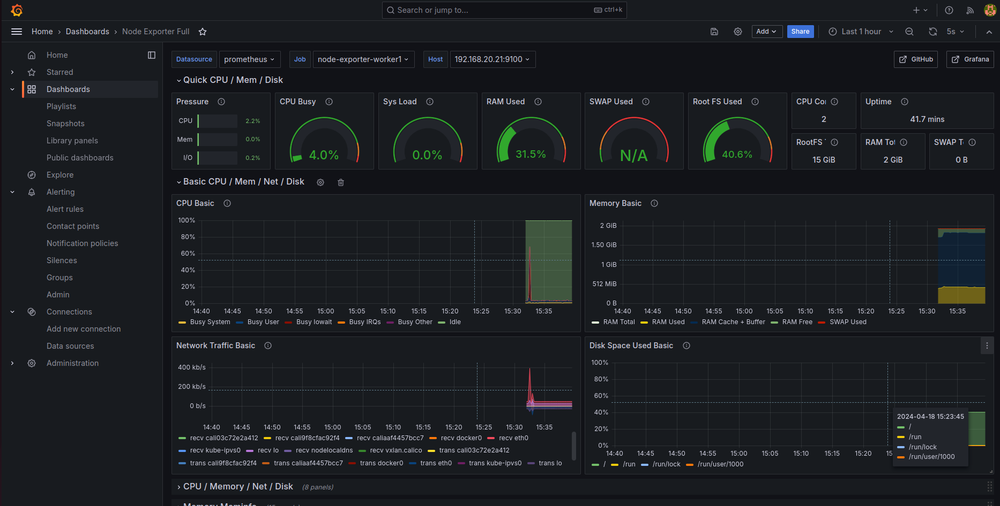
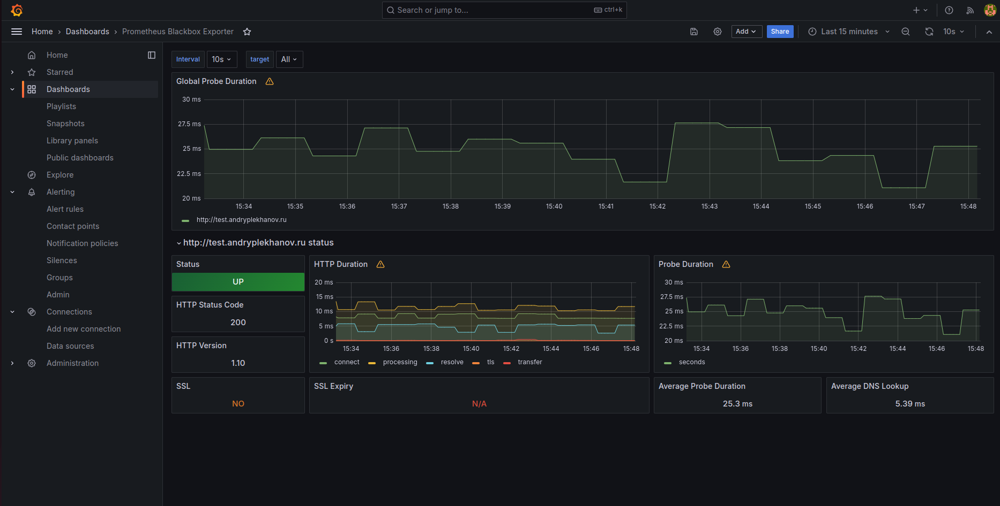
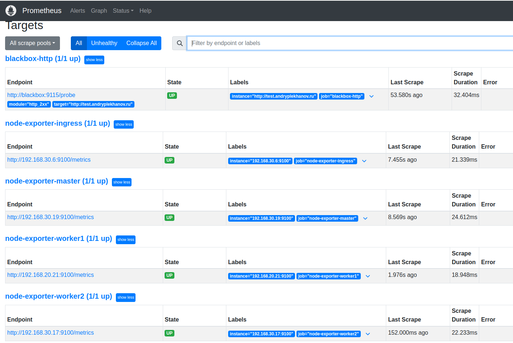
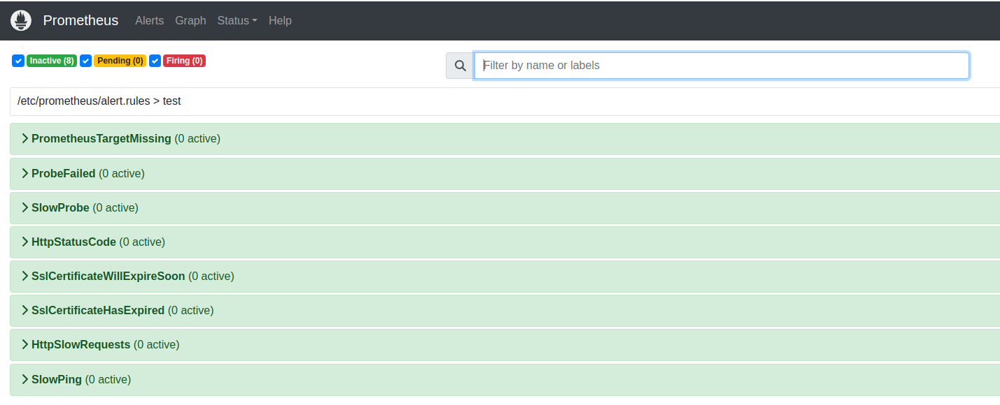
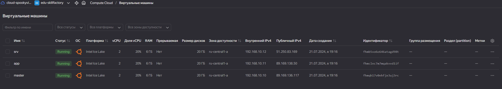

# Финальный проект DevOps
final-project-devops

Проект состоит из файлов для создания облачных ВМ в Яндекс Облаке с помощью Terraform и настройки конфигурации с помощью Ansible.

Первоначальные шаги для установки и работы с проектом:

1) Клонируем репозиторий:
```
git clone git@github.com:Spookyviking/final-project-devops.git
cd final-project-devops
```
2) Устанавливаем необходимые пакеты (Ansible, Terraform) на локальную машину:
```
curl -fsSL https://apt.releases.hashicorp.com/gpg | sudo apt-key add -
sudo apt-add-repository "deb [arch=amd64] https://apt.releases.hashicorp.com $(lsb_release -cs) main"
sudo apt update && sudo apt install -y ansible terraform
```
3) Задаём переменные:
   
3.1) В файлах `./terraform-configuration/{main.tf,instance_module.tf}` необходимо изменить значения переменных: `service_account_key_file`, `cloud_id`, `folder_id` на свои. 

3.2) Заходим в директорию `./terraform-configuration/modules/`, далее файл `service-admin.json` необходимо поместить в данную директорию. Этот файт требуется для подключения Terraform к сервисному аккаунту и выполнения задач. В `service-admin.json.bak` приведён пример файла. Сам файл создаётся в Яндекс Облаке при создании ключа сервисного аккаунта.

3.3) В файле `./terraform-configuration/modules/instance_module.tf` в блоке `metadata` реализована отправка публичного ssh-ключа на все три ВМ. При необходимости, можно поменять файл на другой публичный ssh-ключ.

3.4) В файле `./ansible-configuration/roles/ansible-apt/templates/default.j2` необходимо поменять директиву `server_name` на свой домен или поддомен.

3.5) В файле `./logs_and_metrics/prometheus/prometheus.yml` меняем значение директивы `targets` на свой домен или поддомен, по которому доступно приложение.

3.6)  файле `./logs_and_metrics/alertmanager/config.yml` меняем значения `chat_id` и bot_token на значения из своего бота.

5) После установки необходимых зависимостей и задания переменных, запускаем через Terraform процесс развёртывания необходимых ВМ в Яндекс облаке и их автоматическую последующую настройку посредством Ansible:
```
cd terraform-configuration
terraform init
terraform plan
terraform apply
```
После запуска начнется создание сети, подсети и трех ВМ в Яндекс Облаке. Две из них (master и app) для кластера Kubernetes, а srv для мониторинга работоспособности ВМ и сбора логов. Сразу после завершения создания ВМ автоматически начнется выполнение скрипта `./terraform-configuration/create_inventory.py`, который на базе файла состояния Terraform создаст содержимое для файла `./ansible-configuration/inventory/servers.yaml`. Далее происходит автоматический запуск Ansible playbook'а `ansible-apt.yaml`, который дождется готовности только что созданных ВМ и произведет на них первоначальную установку необходимых пакетов, таких как `apt-transport-https`, `ca-certificates`, `curl`, `software-properties-common`, `python3-pip`, `virtualenv`, `python3-setuptools`, `gnupg`, `gnupg2`, `gpg`, `unzip`.

Далее последует подготовка внутренней инфраструктуры всех серверов, а конкретно:
1) Подготовка серверов `k8s_master` и `k8s_app` для работы в кластере Kubernetes, установка Helm на `k8s_master`;
2) Инициализация кластера Kubernetes;
3) Подготовка `Docker` и `docker-compose` на сервере `srv` и запуск docker-compose.yaml с сервисами сборки и отображения метрик и логов.

После завершения работы terraform и всех ansible playbooks выполним команды ниже для подключения ноды к кластеру:
```commandline
###Выполняем на мастере для получение первого токена
sudo kubeadm token list
###Выполняем на мастере для получение второго токена
openssl x509 -pubkey -in /etc/kubernetes/pki/ca.crt | openssl rsa -pubin -outform der 2>/dev/null | openssl dgst -sha256 -hex | sed 's/^.* //'
###Составляем команду и выполняем на k8s_app
sudo kubeadm join 192.168.10.10:6443 --token <токен_из_первой_команды> --discovery-token-ca-cert-hash sha256:<токен_из_второй_команды>
```
Далее заходим по ssh на `k8s_master` и выполняем следующие команды:
```commandline
cd ./helm_chart
helm install app .
kubectl port-forward --address 0.0.0.0  <имя_пода_приложения>  8000:3003 &
```
В настройках DNS зоны домена добавляем A-запись на сервер `k8s_master`. После обновления DNS, приложение станет доступно по имени домена/поддомена.

Фотооотчёт:

- 

- 

- 

- 

- 

[DockerHub для проверки] (https://hub.docker.com/repository/docker/spookyviking/django-app/general)